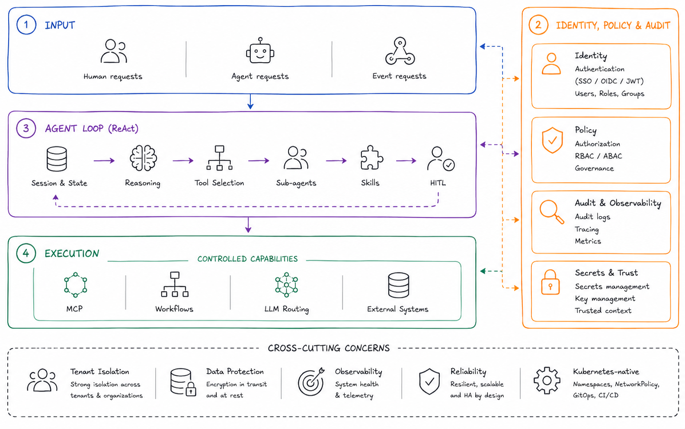
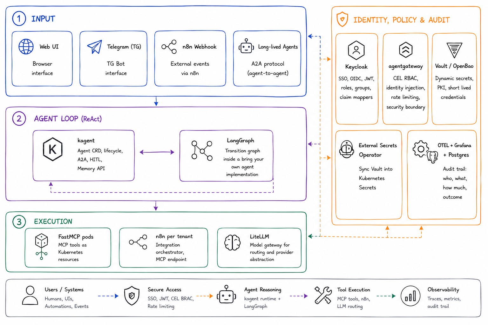
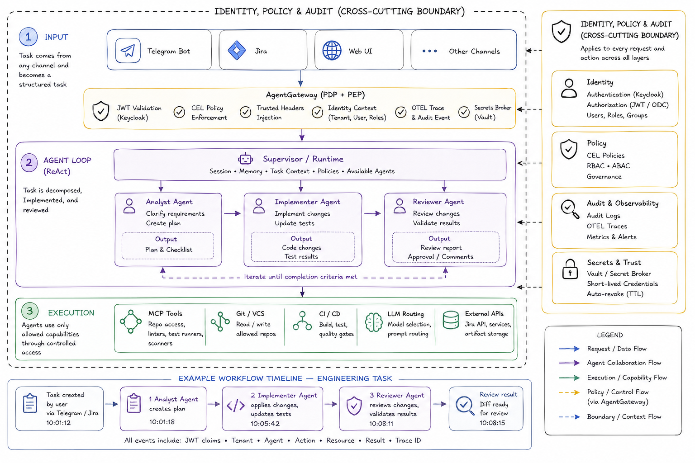

# Enterprise AI Harness

> **An opinionated reference architecture for building and operating self-hosted enterprise AI agent systems on Kubernetes.**


There is no shortage of articles about building AI agents. What remains much rarer is a practical discussion of how to run them safely in production. This repository is not another agent runtime or orchestration framework. It focuses on the architectural layer around AI agents - where the boundaries of a self-hosted enterprise AI harness should actually be drawn.

The model presented here is a reference architecture, not a product and not a framework. It aims to open a discussion about how those boundaries should be drawn in self-hosted enterprise AI harnesses.

The full reasoning is developed in the [article series](#article-series); this README is a README-oriented summary of it.

---

# Architecture

The harness separates responsibilities into four architectural layers:

- **Input** - the entry layer
- **Agent Loop (ReAct)** - the agent cycle layer
- **Execution** - the execution layer
- **Identity, Policy & Audit** - the cross-cutting layer for identity, permissions, and audit



These are architectural boundaries, not software components. Two concerns cut across the whole system and do not belong to a single layer: multi-tenancy affects both runtime and data isolation, and Kubernetes-native deployment defines the operating context rather than the harness itself.

## The problem is the boundaries, not the components

The ecosystem already offers solutions for identity, agent runtimes, model routing, workflow orchestration, tool execution, and secret management. The hard part begins exactly where those systems touch each other:

- How does user identity survive all the way to an MCP call?
- Where does the agent runtime stop and the execution layer begin?
- Which capabilities should stay inside the pod, and which should cross a network boundary?
- How do you isolate tenant runtime without breaking agent-to-agent interaction?

The answers to those questions, rather than the search for yet another framework, shaped the architecture presented here. It uses concrete open-source implementations rather than remaining an abstract diagram, so individual components can be replaced without changing the architecture itself as the ecosystem evolves.

## The four layers

**Input** is where user, agent, and event-driven traffic get separated. A human enters through a browser and SSO. An agent enters through JWT and A2A (Agent-to-Agent). External events such as alerts or CRM hooks may enter through a webhook. These contours pass through identity and policy differently, so merging them too early blurs the boundaries.

**Agent Loop (ReAct)** is where state, reaction to events, and next-action selection live. Here the agent stops being "one request to a model" and becomes a process with memory, delegation, and HITL (Human-in-the-Loop). Without it the agent is just a stateless function, not a system.

**Execution** is managed access to external resources. Tools, workflows, and LLM calls all go through controlled boundaries, with access limited per tool. That might be an MCP server, an n8n workflow, or an LLM provider. In every case it is access to a capability, not direct reach into a backend.

**Identity, Policy & Audit** is the cross-cutting layer for identity, permissions, control, and investigation. Identity and Policy answer who is allowed to do what. Audit answers who actually did what. The first two protect the system, the third lets you investigate incidents. Without it the harness stays an unsafe construction, so it is worth its own architectural slice.

Data isolation is treated as a layered concern rather than a single toggle: platform data via PostgreSQL RLS, agent runtime via per-tenant namespace and NetworkPolicy, session and state via header-scoped boundaries at a trusted gateway, and secrets via per-tenant paths in Vault.

### Skills vs. tools

Skills are pod-local capability injection - OCI images with `SKILL.md` and supporting scripts, mounted into the agent pod at startup. Only skill metadata enters the prompt path; the full `SKILL.md` is loaded lazily when a skill is actually used. Skills live inside the image lifecycle and extend the agent itself. Tools live in the runtime network and expose external capabilities. These are different operational patterns; treating them as the same makes the design less clear.



The boundaries run not between modules but between logically related groups of components.

## One request across all four layers

A concrete example shows the four layers in a single request: add a new validation to an API method, update the tests, and prepare the resulting diff for review.



- **Input and Identity:** The task arrives from Telegram, Jira, a Web UI, or another working channel and immediately becomes a structured task rather than a chat message. A Telegram bot or frontend obtains a JWT from Keycloak and forwards the request through agentgateway, which validates the token, checks CEL policy, injects trusted headers, writes an OTEL trace, and hands the agent a trusted identity context - who placed the task, which tenant it came from, and with which permissions it can be executed.
- **Agent Loop (ReAct):** kagent raises a session and works with task context (goal, constraints, available scope, completion criteria, available agent roles). Through agentgateway it determines which sub-agents are available - for example analyst, implementer, and reviewer - and walks the task through the chain from task to agents to flow to review.
- **Execution:** Each sub-agent gets only its allowed set of capabilities and tools through agentgateway. Access to MCP tools and backend services goes through a controlled access path, bounded by policy, scope, approval, and network isolation. The agent can change only allowed files, run only allowed checks, and never holds permanent access to secrets - credentials are issued as short-lived, auto-revocable tokens.
- **Identity, Policy & Audit:** runs as a cross-cutting layer across the whole route. At every step the system records who initiated the action (JWT claims), what the policy allowed (CEL), which agent performed what, and which checks passed (OTEL traces and audit events). The agent never sees secrets directly; access is granted through Vault or another secret broker and then revoked, keeping reasoning, execution, and privileged access cleanly separated.

---

# Design Principles

- Self-hosted by design
- Enterprise-first architecture
- Kubernetes-native
- Security before convenience
- Multi-tenant from day one
- Open-source ecosystem
- Clear architectural boundaries
- Opinionated, but extensible

---

# Article Series

This repository accompanies a series of articles describing the architecture and implementation.

- Part I - Architecture ([article](docs/articles/Toward%20a%20Four-Layer%20Architecture%20for%20Self-Hosted%20Enterprise%20AI%20Harnesses.md) / [Habr (Russian)](https://habr.com/p/1057942/))
- Part II - Isolation ([Habr (Russian)](docs/articles/Reference%20Implementation%20on%20Kind%20-%20Three%20Layers%2C%20Borders%20Without%20Identity.habr.md) / [deployment guide](isolation/DEPLOYMENT.md) / [demo](isolation/))
- Part III - Identity _(planned - adds the fourth layer on top of the borders; [demo placeholder](identity-demo/))_
- Part IV - Loop Engineering _(planned)_
- Part V - Graph Engineering _(planned)_
- Part VI - Production Lessons _(planned)_

> Part II is the intermediate state: the first three layers (Input, Agent Loop,
> Execution) running on a local Kind cluster, with tenants isolated by
> infrastructure borders (namespace, NetworkPolicy, PostgreSQL RLS) rather than
> by an identity layer. The fourth layer - Identity, Policy & Audit - is
> deliberately deferred and is the subject of Part III.

---

# Repository Structure

```
docs/
  articles/        Published article series (Part I-VI)
  docs/diagrams/        Architecture diagrams
isolation/         Part II - runnable Kind demo (three layers, borders without identity)
identity-demo/     Part III - Identity layer demo (placeholder)
```

The [`isolation/`](isolation/) directory is a self-contained, reproducible slice of
the working implementation that grounds Part II - the cluster setup pipeline, Helm
charts, SQL migrations with RLS, FastMCP tools, the shared Python package, and
end-to-end tests. See [isolation/README.md](isolation/README.md) and the
[deployment guide](isolation/DEPLOYMENT.md). It is deliberately intermediate:
three of the four architectural layers, with tenant isolation via infrastructure
borders and the Identity layer deferred to Part III.

Demo folders for Parts IV-V will be added as the accompanying articles progress.

---

# Technology Foundation

The reference implementation is built on the CNCF ecosystem. The following technologies inform the architecture; implementation artifacts will be published incrementally with the article series.

- Kubernetes
- Gateway API
- kagent
- MCP
- A2A
- Keycloak
- Vault / OpenBao
- External Secrets Operator
- OpenTelemetry
- PostgreSQL
- Redis
- Argo Workflows
- Helm

Technology choices may evolve as the ecosystem matures.

---

# Project Status

Active development. The repository evolves together with the accompanying article series - documentation, implementation details and reusable components are published incrementally.

---

# License

License information will be added before publishing implementation artifacts.