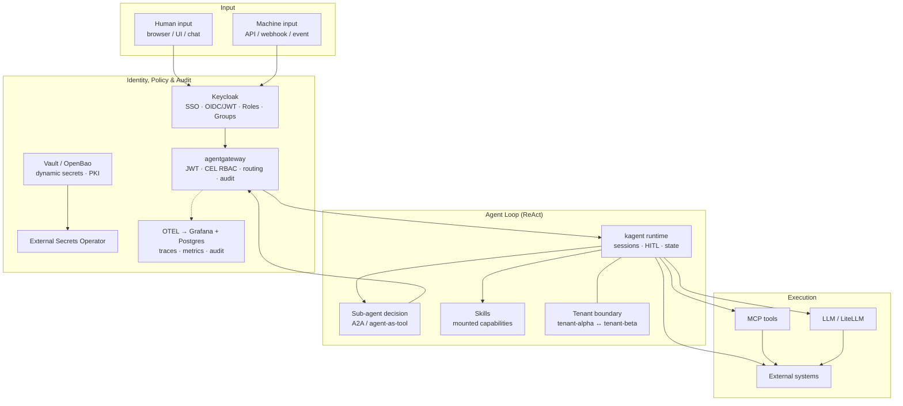
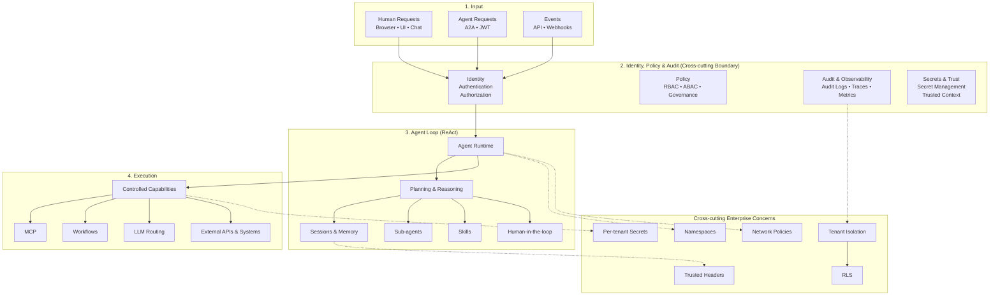
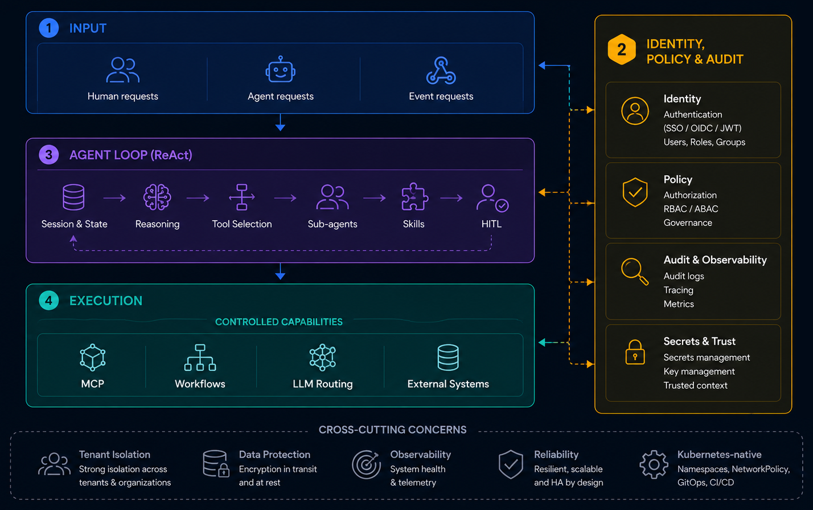

# От Anthropic Cores к 4 слоям: Enterprise AI Harness на open source

Anthropic показали, как работает агентная обвязка. Я не Anthropic, поэтому собрал эту обвязку из доступных компонентов, а не написал свой runtime. Так, чтобы запускать агентов в production могла не только команда гениев из Сан-Франциско, но и обычная platform-команда.

Про то, как сделать агента, написано много. Про то как развернуть его в production, гораздо меньше. Пока нет даже общего языка, что конкретно считать harness, где проходят границы, где еще harness, а где уже нет. Какие слои обязательны, а без каких можно обойтись. Эта статья не закрывает вопрос, а предлагает одну из возможных рамок для обсуждения.

## Что получилось

Reference architecture для self-hosted Enterprise AI Harness на Kubernetes. Четыре функциональных слоя и основные точки интеграции между ними.

Reference architecture 

На схеме четыре слоя: Input, Agent Loop, Execution и Identity, Policy & Audit, каждый из которых разобран ниже. Поверх них два сквозных условия, которые не укладываются в один слой: multi-tenancy (изоляция тенантов живёт и в runtime, и в данных) и Kubernetes-native deployment (это контекст развёртывания, не слой harness).

Это результат разбора модели Anthropic, CNCF-проектов и MCP-экосистемы и сведения десятков компонентов в единую рабочую схему. Не продукт, не framework: архитектурная модель, которую можно собрать из open source-компонентов.

## Почему это вообще сложно

По отдельности большинство этих проектов хорошо документированы. kagent поднимает агента, LiteLLM маршрутизирует модели, FastMCP отдаёт инструменты, Keycloak выпускает токены. Каждый делает своё дело.

Сложность начинается на границах между ними. Как протащить identity от пользователя до MCP-вызова (Model Context Protocol)? Где заканчивается runtime агента и начинается execution? Что делать с capabilities, которые живут локально в pod, и с инструментами, доступ к которым идёт по сети? Как изолировать tenant runtime и при этом не сломать A2A между агентами?

Ответы на эти вопросы, а не выбор ещё одного фреймворка, сформировали архитектуру ниже.

> Для меня главная ценность этой архитектуры не в выборе конкретных проектов. Через год часть из них наверняка изменится. Ценность в границах между слоями: если они выбраны правильно, отдельные компоненты можно заменить, не меняя архитектуру целиком.

## Anthropic Cores

Anthropic описывают harness как runtime для агента: среду, которая принимает события, ведёт stateful-сессию, выдаёт доступ к инструментам и управляет выполнением. Не сам агент и не один из его «умных» промптов, а вся обвязка вокруг него. Без неё агент очень быстро превращается в дорогого собеседника с завышенной самооценкой.

В этой модели агент живёт не в вакууме, а в цикле событий, состояний и действий. Он что-то увидел, что-то вызвал, что-то сохранил, что-то поменял и пошёл дальше. Это не «один компонент», а целая инфраструктура.

В ([Claude Managed Agents](https://platform.claude.com/docs/en/managed-agents/overview)) Harness разложен на четыре core-концепта: Agent, Environment, Session и Events. Agent: не просто модель, а всё, что определяет поведение: model, system prompt, tools, MCP servers и skills. Session: рабочий экземпляр агента в конкретной среде. Events: сообщения, которыми приложение и агент обмениваются. Environment: runtime-среда, в которой всё это вообще имеет шанс происходить. Это не философия ради философии, а сильная и элегантная рамка, в которой удобно думать о runtime.

## Разные условия, разная архитектура

Удобство всегда конкурирует с безопасностью. Anthropic подходят к безопасности как к системному свойству: session, harness и sandbox разделены, credentials вынесены за границу прямого доступа агента. Это работает. Но только если у вас есть ресурсы и команда уровня Anthropic.

Любой продукт в корпоративной среде сталкивается с ревью, диффами, approvals, policy gates и pipeline. Агент уже не может быть просто «умным собеседником». Он должен стать декларативным артефактом, за который не стыдно ни на review, ни в production.

В такой модели уже недостаточно просто «запустить агента». Декларативные агенты и skills не красивая идея, а почти обязательное условие. Если это нельзя ревьюить, тестировать и безопасно выкатывать, рано или поздно оно превращается не в систему, а в зоопарк.

Поэтому Identity и Policy пришлось выделить как самостоятельный архитектурный слой. Environment, наоборот, пришлось вынести за пределы harness: Dev, Test и Prod - это не слой архитектуры, а контекст развёртывания. Kubernetes, namespaces, Helm и NetworkPolicy в этой модели выступают как инфраструктурная среда, а не как часть runtime.

В общем, я зашёл с другой стороны и поднялся на другой уровень абстракции: сгруппировал те core, которые можно сгруппировать, чтобы упростить сборку, и вынес отдельно те части, которые нельзя нормально закрыть одним готовым open source-проектом. Так появились четыре слоя, которые позволяют собирать harness из доступного open source ПО.

## Четыре слоя harness

1. **Input**: слой входа.
2. **Agent Loop (ReAct)**: слой агентного цикла.
3. **Execution**: слой исполнения.
4. **Identity, Policy & Audit**: сквозной слой идентичности, прав и аудита.

Дальше я буду использовать именно эти термины.

**Input**: это слой, где разделяются пользовательский, агентный и событийный трафик. Человек входит через браузер и SSO (Single Sign-On), агент через JWT (JSON Web Token) и A2A (Agent-to-Agent), а внешние события вроде алертов или CRM-хуков могут попадать в систему через webhook в workflow. Эти контуры по-разному проходят identity и policy, поэтому их смешивание только размывает границы и усложняет архитектуру.

**Agent Loop (ReAct)**: состояние, реакция на события, выбор следующего действия. Здесь агент перестаёт быть «одним запросом к модели» и становится процессом с памятью, делегированием задач другим агентам и вмешательством человека (HITL, Human-in-the-Loop). Без этого слоя агент просто функция без состояния, а не система.

**Execution**: слой управляемого доступа к внешним ресурсам. Он включает инструменты, workflow и LLM-вызовы, но не сводится к простому вызову функции: весь трафик проходит через контролируемые границы, а доступ к возможностям ограничивается отдельно для каждого инструмента. Это может быть MCP-сервер, n8n workflow или LLM-провайдер. В любом случае речь идёт о доступе к capability, а не о прямом обращении к бэкенду.

**Identity, Policy & Audit**: сквозной слой идентичности, прав, контроля и расследования. Он отвечает на четыре базовых вопроса.
Identity и Policy: кому и что можно.
Audit: кто и что сделал.
Эти функции служат разным целям, но должны работать вместе: первые защищают систему, второй позволяет разбирать инциденты. Без этого слоя harness остаётся красивой, но небезопасной конструкцией. 
Его стоит выделять как отдельный архитектурный срез, чтобы проще было разграничивать ответственность и анализировать сбои.

Изоляция данных реализуется как четыре взаимодополняющих слоя: RLS в PostgreSQL для platform-данных; namespace-per-tenant и NetworkPolicy для agent runtime; header-scoped изоляция через trusted gateway для session/state; и per-tenant пути в Vault для секретов.

### Skills не Prompt и не Execution
Отдельно стоит отметить природу реализации skills. Skills - это pod-local capability injection: OCI-образы со SKILL.md и скриптами, которые монтируются в pod агента при старте. В prompt попадают только метаданные skill'а, а полный SKILL.md подгружается лениво при обращении к конкретному skill.

Skills живут в lifecycle образа и расширяют самого агента, тогда как tools живут в runtime-сети и дают доступ к внешним возможностям.

## Компоненты по слоям

| Слой | Компонент | Роль |
|---|---|---|
| **Input** | Traefik + oauth2-proxy | Reverse proxy auth для browser UI |
| **Input** | n8n webhook | Machine-traffic вход: внешние события → MCP endpoint |
| **Agent Loop (ReAct)** | kagent | Agent CRD (Custom Resource Definition) lifecycle, A2A, HITL, Memory API |
| **Agent Loop (ReAct)** | LangGraph | Граф переходов внутри BYO-агент |
| **Execution** | FastMCP Pod'ы | MCP-инструменты как K8s-ресурсы |
| **Execution** | n8n (per-tenant) | Integration orchestrator, MCP endpoint |
| **Execution** | MASMCP (in dev) | Multi-agent orchestrator: MCP-серверы + реестр + LLM-маршрутизация |
| **Execution** | LiteLLM | Model gateway: routing, provider abstraction |
| **Identity, Policy & Audit** | Keycloak | SSO, OIDC (OpenID Connect)/JWT, roles, groups, claim-mappers |
| **Identity, Policy & Audit** | agentgateway | CEL RBAC, identity injection, rate limit, security boundary |
| **Identity, Policy & Audit** | Vault / OpenBao | Dynamic secrets, PKI (Public Key Infrastructure), short-lived credentials |
| **Identity, Policy & Audit** | External Secrets Operator | Sync Vault → K8s Secrets |
| **Identity, Policy & Audit** | OTEL + Grafana + Postgres | Audit trail: кто, что, сколько, результат |

Границы проходят не между модулями, а между группами компонентов, которые нужно интегрировать.

## Как это работает вместе

Покажу на конкретном примере, как четыре слоя работают в одном запросе.

Пользователь пишет в Telegram «перезапусти сервис X».

**Input + Identity:** TG Bot получает сообщение, запрашивает JWT у Keycloak и передаёт запрос через agentgateway. agentgateway валидирует токен, проверяет CEL-политику, инжектит trusted headers, пишет OTEL-trace и выдаёт агенту доверенный identity-контекст. Через него же агент получает список доступных MCP-инструментов и, при необходимости, токен доступа к разрешённым capability.

**Agent Loop (ReAct):** kagent поднимает сессию и видит контекст — кто действует, из какого тенанта и с какой ролью. Через agentgateway он сначала определяет доступных "специалистов"(sub-agents). После подтверждения задача делегируется выбранному "специалисту" через A2A. Уже sub-agent через agentgateway определяет свои доступные инструменты.Для опасной операции срабатывает HITL: агент запрашивает подтверждение у человека и выполняет действие.

**Execution:** k8s-sre-agent вызывает разрешённый MCP-инструмент через контролируемый access path. Доступ к инструментам проходит через agentgateway, а выполнение операции ограничивается policy, approval и сетевой изоляцией. Если нужны временные учетные данные, они выдаются как short-lived credentials с TTL и auto-revoke.

**Identity, Policy & Audit** сквозной слой: на каждом шаге кто (JWT claims), что разрешено (CEL), что произошло (OTEL). Секреты агент не видит, доступ выдаётся через Vault и отзывается через 5 минут.

## Что дальше

Каждый из слоёв заслуживает отдельного разбора, от конкретных компонентов до стыковки между собой. В одну статью это не помещается, поэтому дальше разберу слои по отдельности, от input и identity boundary до agent loop и execution layer, и покажу, как из open source-зоопарка получается то, что можно назвать harness.

За последние месяцы вокруг агентных систем появилось огромное количество новых проектов. Но проблема сегодня уже не в том, как написать ещё одного агента, а в том, как безопасно запускать сотни агентов в production. Мне кажется, именно harness может стать тем уровнем абстракции, который для агентных систем окажется тем же, чем Kubernetes стал для контейнеров.

Это не финальная архитектурная истина, а рабочая reference architecture для построения self-hosted Enterprise AI Harness на Kubernetes. A2A-взаимодействие и аудит ещё дорабатываются, нагрузочное тестирование не проводилось. Но базовые цепочки собраны, границы безопасности между слоями и внутри runtime проведены явно. Дальнейшая работа не изобретение новых сущностей, а доводка policy, маршрутов и эксплуатационной надёжности.

Понятие harness пока не устоялось. Разные команды приходят к разным границам, и это нормально. Если вы строили агентную обвязку для или просто думали о том, какие слои обязательны, а без каких можно обойтись, поделитесь опытом в комментариях.