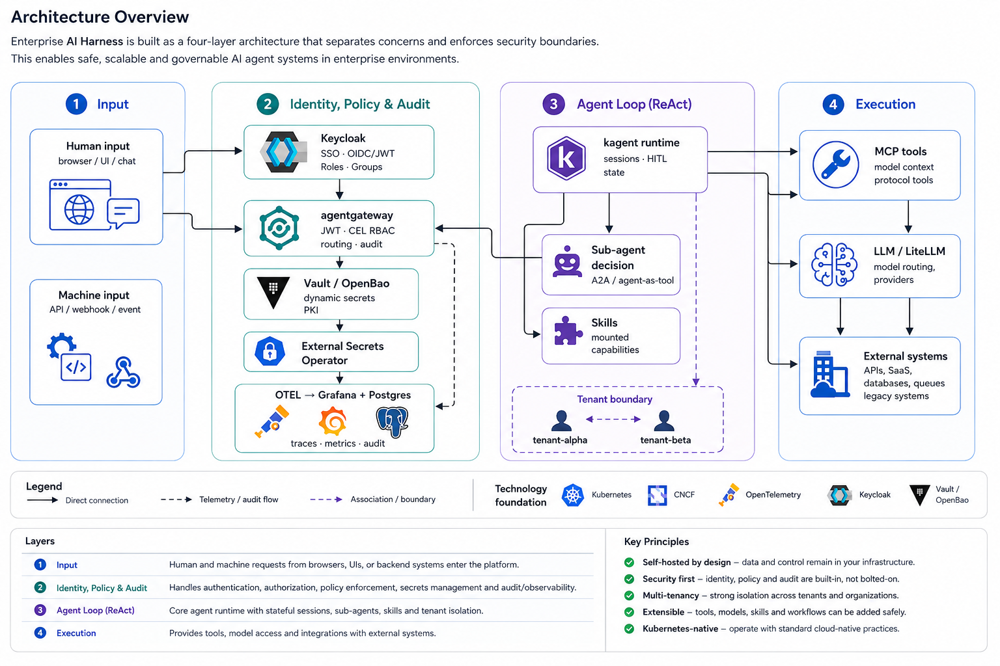

# From Anthropic Cores to 4 Layers: Building an Enterprise AI Harness from Open Source

Anthropic showed how an agent harness works. I'm not Anthropic — so I built one from available components instead of writing my own runtime. The goal: make running agents in production something a regular platform team can pull off, not just a team of geniuses in San Francisco.

There's plenty written about how to build an AI agent. Far less about how to run one safely and predictably in production.

## What Came Out of This

A reference architecture for a self-hosted Enterprise AI Harness on Kubernetes. Four functional layers and the key integration points between them.

Across the diagram, these are four layers — Input, Agent Loop, Execution, and Identity, Policy & Audit — each broken down in detail below. On top of that, two cross-cutting concerns that don't fit neatly into a single layer: multi-tenancy (tenant isolation lives in both the runtime and the data) and Kubernetes-native deployment (this is a deployment context, not a harness layer).

This architecture is the result of studying Anthropic's model, CNCF projects, and the MCP ecosystem — and consolidating dozens of components into a single working model. Not a standalone product or framework — an architectural model assembled from open source components.

## Why This Is Hard

Individually, most of these projects are well documented. kagent spins up an agent, LiteLLM routes models, FastMCP serves tools, Keycloak issues tokens — each does its job.

The complexity starts at the boundaries between them. How do you propagate identity from the user all the way to an MCP call? Where does the agent runtime end and execution begin? What about capabilities that live locally in a pod versus tools that go over the network? How do you isolate a tenant's runtime without breaking A2A between agents?

Answering these questions, not choosing yet another framework, is what shaped the architecture below.

> For me, the main value of this architecture isn't in the choice of specific projects. A year from now, some of them will likely change. The value is in the boundaries between layers: if those are chosen correctly, individual components can be replaced without redesigning the entire architecture.

## Anthropic Cores

Anthropic describes a harness as a runtime for an agent: an environment that receives events, maintains stateful sessions, provides access to tools, and manages execution. Not the agent itself or one of its "smart" prompts. The entire infrastructure around it. Without it, an agent quickly becomes an expensive conversationalist with an inflated sense of confidence.

In this model, the agent doesn't live in a vacuum. It operates in a cycle of events, states, and actions. It observes something, calls something, saves something, changes something — and moves on. This isn't "one component" — it's an entire infrastructure.

Anthropic breaks the harness into four core concepts — Agent, Environment, Session, and Events ([Managed Agents](https://platform.claude.com/docs/en/managed-agents/overview)). Agent is not just a model — it's everything that defines behavior: model, system prompt, tools, MCP servers, and skills. Session is a running instance of an agent in a specific environment. Events are the messages exchanged between the application and the agent. Environment is the runtime context that makes all of this possible. This isn't philosophy for its own sake — it's a strong and elegant lens for thinking about agent runtimes.

## Different Requirements, Different Architecture

Convenience always competes with security. Anthropic treats security as a systemic property: session, harness, and sandbox are separated; credentials are kept outside the agent's direct reach. This works. But only if you have Anthropic-level resources and team.

Any product in an enterprise environment faces code reviews, change approvals, policy gates, and pipelines. An agent can no longer be just a "smart conversationalist" — it must become a declarative artifact that holds up to review and survives in production.

In this model, simply "running an agent" is no longer enough. Declarative agents and skills aren't a nice idea — they're practically mandatory: if you can't review, test, and safely roll out an agent, it eventually turns into an unmanageable mess rather than a system.

That's why Identity and Policy had to be extracted as a standalone architectural layer. Environment, on the other hand, had to be moved outside the harness. Dev, Test, and Prod aren't architecture layers — they're deployment contexts. Kubernetes, namespaces, Helm, and NetworkPolicy are the infrastructure environment, not part of the runtime.

So I approached it from another angle and shifted to a different level of abstraction: I grouped the cores that could be grouped to simplify assembly, and separated out the parts that can't be reasonably covered by a single open source project. That's how the four layers emerged — allowing you to build a harness from available open source software.

## The Four Layers of the Harness

1. **Input** — the entry layer.
2. **Agent Loop (ReAct)** — the agent cycle layer.
3. **Execution** — the execution layer.
4. **Identity, Policy & Audit** — the cross-cutting layer for identity, permissions, and audit.

I'll use these terms consistently from here on.

**Input** — the entry layer: human and machine traffic that shouldn't be mixed. A person comes through a browser and SSO; an agent comes through JWT and A2A. An external event (an alert, a CRM webhook) can also be an input — through a webhook into a workflow. Each entry point goes through identity and policy in its own way, and mixing them is unnecessary complexity.

**Agent Loop (ReAct)** — state, event response, choosing the next action. This is where the agent stops being "one request to a model" and becomes a process — with memory, task delegation to other agents, and human-in-the-loop (HITL). Without this layer, an agent is just a stateless function, not a system.

**Execution** — tools, workflows, LLM calls, and controlled access to capabilities. The agent doesn't call backends directly — all traffic passes through a unified security boundary. A tool can be anything: an MCP server, an n8n workflow, an LLM provider behind a model gateway. Execution isn't "a function call" — it's controlled access to capabilities that may themselves be complex orchestrators.

**Identity, Policy & Audit** — the cross-cutting layer for identity, permissions, control, and investigation. Who is acting? What's allowed? How is it verified? How do you figure out what happened after the fact? Identity and Policy are the gates: deny entry, refuse permission. Audit is the camera: record who did what and when. They work together but serve different purposes — the former protects the system, the latter gives you the ability to investigate when something goes wrong. Without answers to these four questions, a harness is a beautiful but insecure toy. In an enterprise setting, this layer is better off as a separate architectural slice. It makes it easier to separate responsibilities and investigate incidents.

Data isolation isn't a one-size-fits-all technique. Platform data (tenants, users, audit) is isolated through Row-Level Security in PostgreSQL. Agent runtime data (sessions, state, memory) lives in a different model — namespace-per-tenant, NetworkPolicy, and trusted headers from the gateway.

In this architecture, there are two security boundaries: between layers (the gateway controls who can call what) and within the runtime between tenants (namespaces, NetworkPolicy, trusted headers).

### Skills Are Not Execution

Skills are OCI images with a SKILL.md and scripts that get mounted into the agent's pod at startup. SKILL.md goes into the system prompt; scripts run locally inside the agent's pod via `bash()`. Skills are baked into the agent itself — they're its own capabilities, not external calls.

Tools (MCP) are a separate Pod/Service — an HTTP call through the gateway, with identity context, CEL policy, and audit on every call.

Different lifecycle, different security boundary: skills are governed at the image level (registry, image pull policy); tools are governed at the gateway level. That's why skills don't appear in the table below among Execution tools — they're pod-local capability injection, not an execution path through the gateway.

## Components by Layer

| Layer | Component | Role |
|---|---|---|
| **Input** | Traefik + oauth2-proxy | Reverse proxy auth for browser UI |
| **Input** | n8n webhook | Machine-traffic entry: external events → MCP endpoint |
| **Agent Loop (ReAct)** | kagent | Agent CRD lifecycle, A2A, HITL, Memory API |
| **Agent Loop (ReAct)** | LangGraph | Transition graph inside a BYO agent |
| **Execution** | FastMCP Pods | MCP tools as K8s resources |
| **Execution** | n8n (per-tenant) | Integration orchestrator, MCP endpoint |
| **Execution** | MASMCP (in dev) | Multi-agent orchestrator: MCP servers + registry + LLM routing |
| **Execution** | LiteLLM | Model gateway: routing, provider abstraction |
| **Identity, Policy & Audit** | Keycloak | SSO, OIDC/JWT, roles, groups, claim-mappers |
| **Identity, Policy & Audit** | agentgateway | CEL RBAC, identity injection, rate limit, security boundary |
| **Identity, Policy & Audit** | Vault / OpenBao | Dynamic secrets, PKI, short-lived credentials |
| **Identity, Policy & Audit** | External Secrets Operator | Sync Vault → K8s Secrets |
| **Identity, Policy & Audit** | OTEL + Grafana + Postgres | Audit trail: who, what, how long, result |

The boundaries aren't between modules of a single product — they're between groups of components that need to be integrated.

## How It All Works Together

Let me show with a concrete example how the four layers handle a single request.

A user sends a message via Telegram: "restart service X."

**Input + Identity:** The Telegram bot receives the message → requests a JWT from Keycloak → the request goes through agentgateway. agentgateway validates the token, checks the CEL policy (`tenant_id == it AND role == operator`), injects `X-User-Id` and `X-Tenant-Id` headers, writes an OTEL trace — and routes to the agent.

**Agent Loop (ReAct):** kagent starts a session, sees the context (who, which tenant, which role). A restart operation is dangerous — HITL kicks in: the agent asks the human for confirmation. The human confirms → the agent delegates the task to a sub-agent (k8s-sre-agent) via A2A, again through agentgateway with the same checks and tracing.

**Execution:** k8s-sre-agent calls ssh-tools MCP → agentgateway requests dynamic credentials from Vault (TTL 5 min, auto-revoke) → the agent gets access to the cluster but never sees the secret → executes `kubectl restart`. The tool call is logged with identity context.

**Identity, Policy & Audit** — the cross-cutting layer: at every step — who (JWT claims), what's allowed (CEL), what happened (OTEL). The agent never sees secrets; access is issued through Vault and revoked after 5 minutes.

I didn't write any of these parts myself. Everything is assembled from open source and connected through layer boundaries.

## What Comes Next

Each layer deserves its own deep dive — from specific components to how they connect. That won't fit in one article, so I'll cover the layers individually: from input and identity boundaries to the agent loop and execution layer — showing how an open source collection becomes what you could call a harness.

Over the past few months, an enormous number of new projects have appeared around agent systems. But the problem today is no longer how to build yet another agent — it's how to safely run hundreds of agents in production. I think the harness will become for agent systems what Kubernetes became for containers.

This isn't a final architectural truth — it's a working reference architecture for building a self-hosted Enterprise AI Harness on Kubernetes. A2A interactions and audit are still being refined; load testing hasn't been done yet. But the basic chains are assembled, and security boundaries — between layers and within the runtime — are drawn explicitly. The work ahead isn't about inventing new entities — it's about refining policies, routes, and operational reliability.

## Project Repository

This article is the first part of an ongoing series on Enterprise AI Harness — a reference architecture for building self-hosted enterprise AI agent systems on Kubernetes.

The repository evolves together with the article series and gradually publishes architecture documentation, design decisions, diagrams, implementation artifacts, and reusable configurations. It's a living engineering reference, not a product.

**[github.com/vasiache/enterprise-ai-harness](https://github.com/vasiache/enterprise-ai-harness)**

---

If you're building enterprise AI infrastructure and wrestling with similar boundaries — identity propagation, tenant isolation, execution security — I'd be interested to hear how you're approaching these problems. The next articles will cover each layer in depth: input boundary, identity and policy, agent loop, and execution. Follow along if you want to see how the pieces fit together.