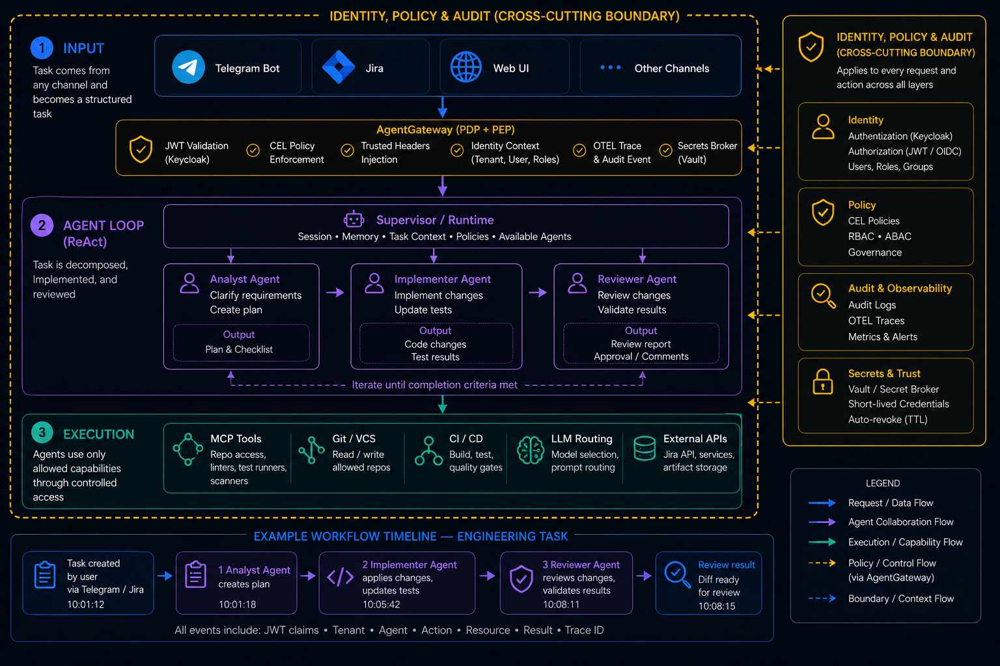

# From Anthropic Cores to Four Layers of Enterprise AI Harness

There is no shortage of articles about building AI agents. Articles about running them safely in production are still much rarer.

That gap matters. We still do not have a stable shared language for what a harness actually is, where its boundaries sit, or which parts are essential versus optional. This piece is not an attempt to settle the definition once and for all. It is a practical architectural frame that helped me make sense of the problem.

## The shape of the model

The result is a reference architecture for a self hosted Enterprise AI Harness on Kubernetes. It has four functional layers and a set of clear integration boundaries between them.

The four layers are Input, Agent Loop, Execution, and Identity, Policy & Audit, each covered below. Two other concerns cut across the whole system and do not belong to a single layer. Multi tenancy affects both runtime and data isolation. Kubernetes native deployment defines the operating context rather than the harness itself.

This model came out of comparing Anthropic's harness concepts, CNCF oriented building blocks, and the MCP ecosystem, then reducing all of that into one scheme that can actually be assembled from open source components. It is not a product and not a framework. It is a reference architecture.

## Why the problem is harder than it looks

Individually, most of these projects are well documented. kagent can manage the agent lifecycle. LiteLLM can route model traffic. FastMCP can expose tools. Keycloak can issue tokens. Each one does its job.

The hard part begins exactly where those systems touch each other. How does user identity survive all the way to an MCP call, Model Context Protocol. Where does the agent runtime stop and the execution layer begin. What should be treated as a pod local capability and what should stay behind a network boundary. How do you isolate tenant runtime without breaking agent to agent interaction.

The answers to those questions, not the search for one more framework, shaped the architecture below.

> For me, the main value here is not the choice of specific components. Some of them will inevitably change. The valuable part is the boundary design. If those boundaries are right, individual components can be replaced without rebuilding the whole architecture.

## Starting from Anthropic Cores

Anthropic describes a harness as the runtime around the agent. It is the environment that accepts events, maintains a stateful session, exposes tools, and governs execution. Not the agent itself and not one of its smart prompts, but the whole operational shell around it. Without that shell, an agent very quickly turns into an expensive conversationalist with an inflated sense of its own competence.

That framing matters because it moves the conversation away from a single smart model call and toward an eventful system with state, actions, and side effects. An agent sees something, calls something, stores something, changes something, and continues. That is already infrastructure, not just prompting.

In [Claude Managed Agents](https://platform.claude.com/docs/en/managed-agents/overview), the harness is split into four core concepts. Agent, Environment, Session, and Events. Agent is not just the model but everything that defines behavior: model, system prompt, tools, MCP servers, and skills. Session is a working instance of the agent in a specific environment. Events are the messages the application and agent exchange. Environment is the runtime where all of that has a chance to happen in the first place. It is a clean and elegant frame for thinking about runtime, and I found it a useful starting point, but not quite sufficient for a self hosted enterprise setup.

## Why enterprise changes the picture

Convenience and safety rarely pull in the same direction. Anthropic treats safety as a system property. Session, model, and sandbox are separated, and credentials stay outside the agent's direct reach. That works. But only when you have the resources and the team of Anthropic's caliber.

Anything running in an enterprise environment runs into reviews, diffs, approvals, policy gates, and pipelines. At that point, an agent cannot remain just an intelligent conversational layer. It has to become a declarative artifact you are not ashamed to bring to review or to ship to production.

In that model, simply "running an agent" is no longer enough. Declarative agents and skills are not a nice idea but almost a requirement. If you cannot review, test, and ship them safely, the result eventually stops being a system and becomes a zoo.

That is why Identity and Policy had to become an explicit architectural layer in my model. Environment, on the other hand, had to move outside the harness. Dev, Test, and Prod are not architectural layers but deployment contexts. Kubernetes, namespaces, Helm, and NetworkPolicy belong to the infrastructure environment, not to the harness runtime.

So instead of mapping Anthropic's cores one to one, I came at it from a different angle and a higher level of abstraction. I grouped the cores that could be grouped to make assembly simpler, and pulled out the parts that cannot be cleanly covered by a single ready made open source project. That is how the four layers came about, the ones that let you assemble a harness from available open source software.

## Four layers

1. **Input** is the entry layer.
2. **Agent Loop (ReAct)** is the agent cycle layer.
3. **Execution** is the execution layer.
4. **Identity, Policy & Audit** is the cross cutting layer for identity, permissions, and audit.

These are the terms I will use throughout the rest of the article.

**Input** is where user traffic, agent traffic, and event driven traffic get separated. A human enters through a browser and SSO, Single Sign On. An agent enters through JWT, JSON Web Token, and A2A, Agent to Agent. External events such as alerts or CRM hooks may enter through a webhook into a workflow. These contours pass through identity and policy differently, so merging them too early only blurs the boundaries and complicates the architecture.

**Agent Loop (ReAct)** is where state, reaction to events, and next action selection live. Here the agent stops being "one request to a model" and becomes a process with memory, delegation to other agents, and HITL, Human in the Loop. Without this layer the agent is just a stateless function, not a system.

**Execution** is the layer of managed access to external resources. It includes tools, workflows, and LLM calls, but it is not reducible to a function call. All traffic goes through controlled boundaries, and access to capabilities is limited per tool. That might be an MCP server, an n8n workflow, or an LLM provider. In every case it is access to a capability, not direct reach into a backend.

**Identity, Policy & Audit** is the cross cutting layer for identity, permissions, control, and investigation. It answers four basic questions. Identity and Policy answer who is allowed to do what. Audit answers who actually did what. These functions serve different purposes but have to work together. The first two protect the system, the third lets you investigate incidents. Without this layer the harness stays a pretty but unsafe construction. It is worth calling out as its own architectural slice because it makes separating responsibility and analyzing failures easier.

I also treat data isolation as a layered concern rather than a single toggle. Platform data can be isolated with PostgreSQL RLS. Agent runtime can be isolated with namespace per tenant and NetworkPolicy. Session and state can be isolated through header scoped boundaries at a trusted gateway. Secrets can be isolated with per tenant paths in Vault.

### Skills are their own thing

It is worth calling out the nature of skills separately. Skills are pod local capability injection. Practically, that means OCI images with SKILL.md and supporting scripts, mounted into the agent pod at startup. Only the skill metadata enters the prompt path. The full SKILL.md is loaded lazily, only when that specific skill is actually used.

Skills live inside the image lifecycle and extend the agent itself, while tools live in the runtime network and expose external capabilities. Those are different operational patterns, and treating them as the same thing makes the design less clear.

## Components in each layer

| Layer | Component | Role |
|---|---|---|
| **Input** | Traefik + oauth2-proxy | Reverse proxy auth for browser UI |
| **Input** | n8n webhook | Machine traffic entry: external events into an MCP endpoint |
| **Agent Loop (ReAct)** | kagent | Agent CRD, Custom Resource Definition, lifecycle, A2A, HITL, Memory API |
| **Agent Loop (ReAct)** | LangGraph | Transition graph inside a bring your own agent implementation |
| **Execution** | FastMCP pods | MCP tools as Kubernetes resources |
| **Execution** | n8n per tenant | Integration orchestrator, MCP endpoint |
| **Execution** | LiteLLM | Model gateway for routing and provider abstraction |
| **Identity, Policy & Audit** | Keycloak | SSO, OIDC, OpenID Connect, JWT, roles, groups, claim mappers |
| **Identity, Policy & Audit** | agentgateway | CEL RBAC, identity injection, rate limiting, security boundary |
| **Identity, Policy & Audit** | Vault or OpenBao | Dynamic secrets, PKI, Public Key Infrastructure, short lived credentials |
| **Identity, Policy & Audit** | External Secrets Operator | Sync Vault into Kubernetes Secrets |
| **Identity, Policy & Audit** | OTEL + Grafana + Postgres | Audit trail: who, what, how much, outcome |

The boundaries run not between modules but between logically related groups of components.

## One request across all four layers

A concrete example shows how the four layers work together in a single request. Take the pattern from [AI Agents & Agentic Workflows](https://medium.com/towards-applied-generative-ai/ai-agents-agentic-workflows-f558674ee18b). A task comes in, gets distributed across agents, passes through a workflow, and finishes with a review of the result. As a concrete engineering example: add a new validation to an API method, update the tests, and prepare the resulting diff for review.

**Input and Identity.** The task arrives from Telegram, Jira, a Web UI, or another working channel and immediately becomes a structured task rather than a chat message. A Telegram bot or frontend obtains a JWT from Keycloak and forwards the request through agentgateway. The gateway validates the token, checks CEL policy, injects trusted headers, writes an OTEL trace, and hands the agent a trusted identity context. Who placed the task, which tenant it came from, and with which permissions it can be executed.

**Agent Loop (ReAct).** kagent raises a session and works not with raw text but with task context: the goal, constraints, available scope, completion criteria, and available agent roles. Through agentgateway it determines which sub agents are available, for example analyst, implementer, and reviewer, and walks the task through the chain of task to agents to flow to review. One agent clarifies requirements and builds a plan, another makes the changes, and a third runs an independent check of the result.

**Execution.** Each sub agent gets only its allowed set of capabilities and tools through agentgateway, and access to MCP tools and backend services goes through a controlled access path. What the agent can do is bounded by policy, scope, approval, and network isolation. The agent can change only allowed files, run only allowed checks, and never holds permanent access to secrets. When credentials are needed, they are issued as short lived credentials with TTL and auto revocation.

**Identity, Policy & Audit** runs as a cross cutting layer across the whole route. At every step the system records who initiated the action through JWT claims, what the policy allowed through CEL, which agent performed exactly what, and which checks were passed through OTEL traces and audit events. The agent never sees secrets directly. Access is granted through Vault or another secret broker and then automatically revoked, which keeps reasoning, execution, and privileged access cleanly separated.

## What comes next

Each layer deserves its own breakdown, from specific components to the seams between them. That does not fit in one article, so the next pieces will go through the layers one by one, from the input and identity boundary to the agent loop and execution layer, and show how an open source zoo turns into something you can call a harness.

Over the last year an enormous number of new projects have appeared around agent systems. But the problem today is no longer how to write one more agent. It is how to safely run hundreds of agents in production. To me, the harness feels like the level of abstraction that could do for agent systems what Kubernetes did for containers.

This is not a final architectural truth. It is a working reference architecture for building a self hosted Enterprise AI Harness on Kubernetes. A2A interaction and audit are still being refined, and load testing has not been run. But the basic chains are assembled, and the security boundaries between layers and inside the runtime are drawn explicitly. The work ahead is not inventing new entities but polishing policy, routes, and operational reliability.

The notion of a harness is still unsettled. Different teams arrive at different boundaries, and that is normal. If you have built an agent wrapper or simply thought about which layers are mandatory and which you can live without, share your experience in the comments.