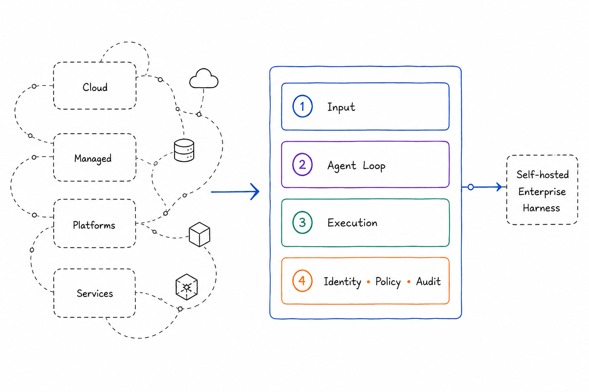

## Toward a Four-Layer Architecture for Self-Hosted Enterprise AI Harnesses

#### There is no shortage of articles about building AI agents. What remains much rarer is a practical discussion of how to run them safely in production.

This article is not about another agent runtime or orchestration framework.

Anthropic describes the runtime around an agent. Open-source projects implement individual capabilities such as routing, memory, identity, and tool execution.

The problem addressed here is different. **where should the architectural boundaries of a self-hosted enterprise AI harness actually be drawn?**

The four layers presented below are not software components. They are architectural boundaries. Rather than proposing another framework, this article aims to open a discussion about how those boundaries should be drawn in self-hosted enterprise AI harnesses. The model presented here is one possible architectural frame for that discussion.

### The problem is not the components. It is the boundaries.

The ecosystem already offers solutions for identity, agent runtimes, model routing, workflow orchestration, tool execution, and secret management.

**The hard part begins exactly where those systems touch each other.**

How does user identity survive all the way to an MCP call? Where does the agent runtime stop and the execution layer begin? Which capabilities should stay inside the pod, and which should cross a network boundary? How do you isolate tenant runtime without breaking agent-to-agent interaction?

**The answers to those questions, rather than the search for yet another framework, shaped the architecture presented below.**

> For me, the main point is not choosing the "right" components, but defining the right architectural boundaries. Architectural ideas only matter when they can be validated in real systems. That is why this reference architecture uses concrete implementations rather than remaining an abstract diagram. As the ecosystem evolves and new alternatives appear, individual components can be replaced without changing the architecture itself.

### The Architectural Frame

The result is a reference architecture for a self-hosted Enterprise AI Harness on Kubernetes, with four functional layers and clear integration boundaries between them.

Two concerns cut across the whole system and do not belong to a single layer. Multi tenancy affects both runtime and data isolation. Kubernetes native deployment defines the operating context rather than the harness itself.

> It is not a product.

> And not a framework.

> It is a reference architecture.

---

### Starting from Anthropic Cores

Anthropic describes a harness as the runtime around the agent. It is the environment that accepts events, maintains a stateful session, exposes tools, and governs execution. Not the agent itself and not one of its smart prompts, but the whole operational shell around it. Without that shell, an agent very quickly turns into an expensive conversationalist with an inflated sense of its own competence.

In [Claude Managed Agents](https://medium.com/r/?url=https%3A%2F%2Fplatform.claude.com%2Fdocs%2Fen%2Fmanaged-agents%2Foverview), the harness is split into four core concepts. Agent, Environment, Session, and Events. Agent is everything that defines behavior, not just the model. Session is a working instance of the agent in an environment. Events are the messages the application and agent exchange. Environment is the runtime where all of it happens. It is a clean and elegant frame, and a useful starting point, but not quite sufficient for a self-hosted enterprise setup.

#### Self-hosted enterprise changes the picture

Convenience and security are often at odds with each other. Anthropic treats safety as a system property. Session, model, and sandbox are separated, and credentials stay outside the agent’s direct reach. That works. But only when you have the resources and the team of Anthropic’s caliber.

In a real enterprise, agents run into reviews, diffs, approvals, policy gates, and pipelines. At that point, an agent cannot remain just an intelligent conversational layer. It has to become a declarative artifact you are not ashamed to bring to review or to ship to production. If you cannot review, test, and ship them safely, the result eventually stops being a system and becomes a zoo.

That is why Identity and Policy had to become an explicit architectural layer in my model. Environment, on the other hand, had to move outside the harness. Dev, Test, and Prod are deployment contexts, not architectural layers. Kubernetes, namespaces, Helm, and NetworkPolicy belong to the infrastructure, not to the harness runtime. That regrouping, with Environment outside and Identity as its own slice, is what makes the four layers below assemble from open source software.

---

### Four layers

1\. **Input** is the entry layer.

2\. **Agent Loop (ReAct)** is the agent cycle layer.

3\. **Execution** is the execution layer.

4\. **Identity, Policy & Audit** is the cross cutting layer for identity, permissions, and audit.

These are the terms I will use throughout the rest of the article.

**Input** is where user, agent, and event driven traffic get separated. A human enters through a browser and SSO(Single Sign On). An agent enters through JWT(JSON Web Token), and A2A(Agent to Agent). External events such as alerts or CRM hooks may enter through a webhook. These contours pass through identity and policy differently, so merging them too early blurs the boundaries.

**Agent Loop (ReAct)** is where state, reaction to events, and next action selection live. Here the agent stops being “one request to a model” and becomes a process with memory, delegation, and HITL(Human in the Loop). Without it the agent is just a stateless function, not a system.

**Execution** is managed access to external resources. Tools, workflows, and LLM calls all go through controlled boundaries, with access limited per tool. That might be an MCP server, an n8n workflow, or an LLM provider. In every case it is access to a capability, not direct reach into a backend.

**Identity, Policy & Audit** is the cross cutting layer for identity, permissions, control, and investigation. Identity and Policy answer who is allowed to do what. Audit answers who actually did what. The first two protect the system, the third lets you investigate incidents. Without it the harness stays a pretty but unsafe construction, so it is worth its own architectural slice.

I also treat data isolation as a layered concern rather than a single toggle. Platform data can be isolated with PostgreSQL RLS. Agent runtime can be isolated with namespace per tenant and NetworkPolicy. Session and state can be isolated through header scoped boundaries at a trusted gateway. Secrets can be isolated with per tenant paths in Vault.

#### Skills are their own thing

It is worth calling out the nature of skills separately. Skills are pod local capability injection. Practically, that means OCI images with SKILL.md and supporting scripts, mounted into the agent pod at startup. Only the skill metadata enters the prompt path. The full SKILL.md is loaded lazily, only when that specific skill is actually used.

Skills live inside the image lifecycle and extend the agent itself. Tools live in the runtime network and expose external capabilities. Those are different operational patterns. Treating them as the same thing makes the design less clear.

**Components in each layer**

The boundaries run not between modules but between logically related groups of components.

---

### One request across all four layers

A concrete example shows the four layers in a single request. Take the pattern from [AI Agents & Agentic Workflows](https://medium.com/towards-applied-generative-ai/ai-agents-agentic-workflows-f558674ee18b). A task comes in, gets distributed across agents, passes through a workflow, and finishes with a review of the result. As an engineering example: add a new validation to an API method, update the tests, and prepare the resulting diff for review.

**Input and Identity:** The task arrives from Telegram, Jira, a Web UI, or another working channel. It immediately becomes a structured task rather than a chat message. A Telegram bot or frontend obtains a JWT from Keycloak and forwards the request through agentgateway. The gateway validates the token, checks CEL policy, injects trusted headers, writes an OTEL trace, and hands the agent a trusted identity context. Who placed the task, which tenant it came from, and with which permissions it can be executed.

**Agent Loop (ReAct):** kagent raises a session and works not with raw text but with task context: the goal, constraints, available scope, completion criteria, and available agent roles. Through agentgateway it determines which sub agents are available, for example analyst, implementer, and reviewer. It walks the task through the chain from task to agents to flow to review. One agent clarifies requirements and builds a plan, another makes the changes, and a third runs an independent check of the result.

**Execution:** Each sub agent gets only its allowed set of capabilities and tools through agentgateway. Access to MCP tools and backend services goes through a controlled access path. What the agent can do is bounded by policy, scope, approval, and network isolation. The agent can change only allowed files, run only allowed checks, and never holds permanent access to secrets. When credentials are needed, they are issued as short lived credentials with TTL and auto revocation.

**Identity, Policy & Audit:** the cross cutting layer across the whole route. At every step the system records who initiated the action through JWT claims, what the policy allowed through CEL, which agent performed exactly what, and which checks were passed through OTEL traces and audit events. The agent never sees secrets directly. Access is granted through Vault or another secret broker and then revoked. That keeps reasoning, execution, and privileged access cleanly separated.

---

**Looking ahead**

The next articles will explore the layers in more detail, starting with the boundaries that are most useful to unpack next, whether that is Identity or the trade-offs behind the architecture itself.

Over the last year, the ecosystem has produced an enormous number of agent frameworks, protocols, and supporting projects. The challenge is no longer building another agent. It is defining the architectural boundaries that allow hundreds of agents to operate safely as a production platform.

The architecture presented here is not the final answer, but a working reference architecture. It is grounded in a real Kubernetes-based implementation, where the core end-to-end flows and proposed architectural boundaries have already been validated. The remaining work focuses on operational maturity: identity propagation, policies, routing, audit, and production hardening rather than on redefining the architecture itself.

The notion of an Enterprise AI Harness is still evolving, and different teams will inevitably draw these boundaries differently. If you’ve built something similar or would draw the boundaries elsewhere, I would genuinely like to hear your perspective. My hope is that this series contributes to a more common architectural language for building self-hosted Enterprise AI Harnesses.

Note: This is an adapted English version of an earlier post published on [Habr](https://medium.com/r/?url=https%3A%2F%2Fhabr.com%2Fp%2F1057942%2F), refined for a Medium audience with improved structure, visuals, and readability